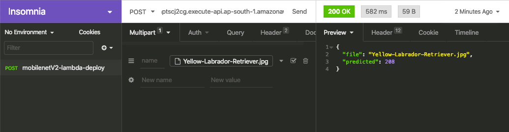

# MobilenetV2 Deployment In AWS-Lambda using Serverless

## Insomania Screenshot

### Input Image

## AWS Endpoint URL

 POST - https://jhptscj2cg.execute-api.ap-south-1.amazonaws.com/dev/classify

Complete Docker project available in [mobilenetV2-deploy-lambda](mobilenetV2-deploy-lambda)

MobilenetV2 pre-trained model generated using [pytorch_vision_mobilenet_v2.ipynb](pytorch_vision_mobilenet_v2.ipynb)

