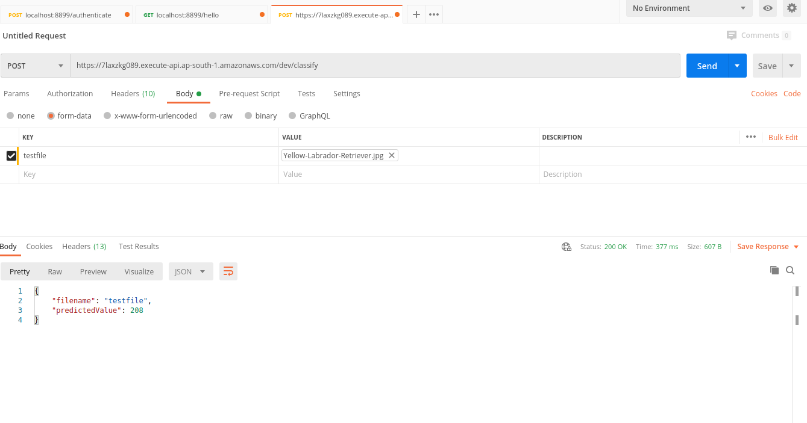

# MobilenetV2 Deployment In AWS-Lambda using Serverless

AWS Lambda can do heavy lifting things, which otherwise needed high memory infrastructure. AWS Lambda has limitations with respect to the upload size. One solution to tackle this is create a requirements.txt that can download the necessary dependencies.

AWS Lambda works as a container. So I deployed container in Lambda. What is the benefit?..One docker image can have pytorch models and another can have tensorflow or keras. One can have python2.x dependencies another can have Python3.x

In this example, I choose the opensource serverless framework , created docker image and deployed in AWS lambda. Serverless framework creates deployment stack using serverless.yml. My serverless.yml stack includes S3, Amazon API Gateway, AWS Cloudwatch for logs, AWS Lambda and ofcource AWS IAM services. handler.py is the entry point that executes AWS Lamda function with Pytoch models resnet34 and Mobilenetv2.

### MobilenetV2 Model Description

The MobileNet v2 architecture is based on an inverted residual structure where the input and output of the residual block are thin bottleneck layers opposite to traditional residual models which use expanded representations in the input. MobileNet v2 uses lightweight depthwise convolutions to filter features in the intermediate expansion layer. Additionally, non-linearities in the narrow layers were removed in order to maintain representational power.

 | 

***Here we are using MobilenetV2 model pre-trained using Imagenet dataset***

model generated using [pytorch_vision_mobilenet_v2.ipynb](pytorch_vision_mobilenet_v2.ipynb)

### AWS Endpoint URL for MobilenetV2

 POST - https://jhptscj2cg.execute-api.ap-south-1.amazonaws.com/dev/classify

Complete Docker project available in [mobilenetV2-deploy-lambda](mobilenetV2-deploy-lambda)

## Insomania Screenshot

### Postman Screenshot

### Input Image

### AWS Endpoint URL for Resnet34

POST - https://7d066kjjhc.execute-api.ap-south-1.amazonaws.com/dev/classify

